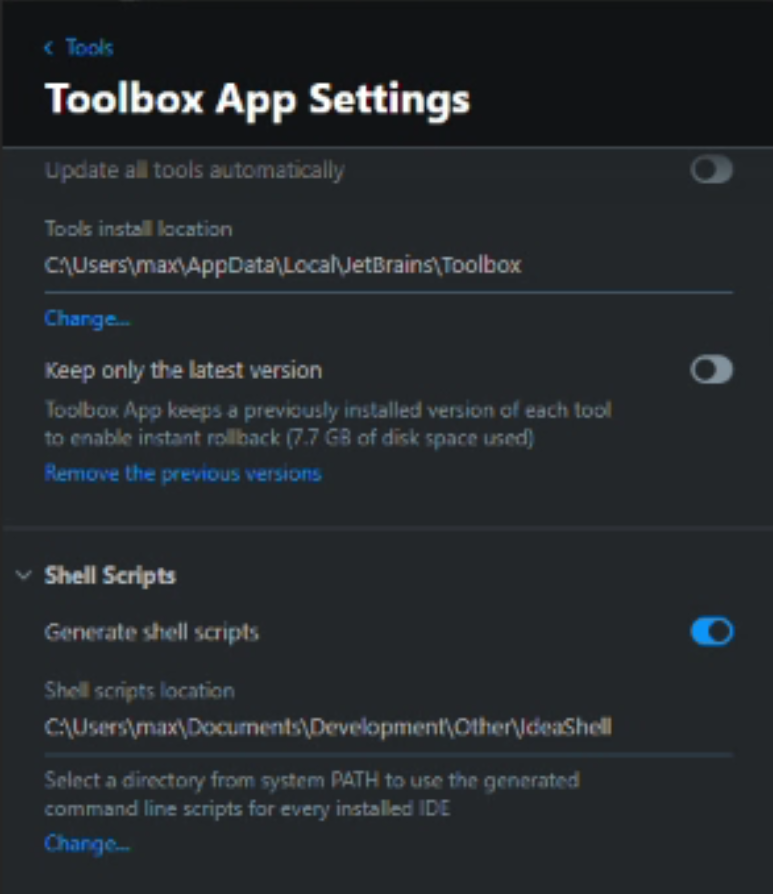
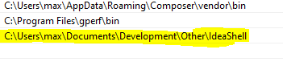

# Run IntelliJ out of wsl

=> Intellij will start in this Windows Environment!

## Showcase

* Open current folder: `idea .` 
* Open specific folder: `idea /mnt/c/Users/max/Videos`

## Howto

### Create shell scripts in toolbox



### Add path to environment



### Create these functions in ~/.bashrc

```
idea() {
   if [ -z "$1" ];
   then
     FOLDER=".";
   else
     FOLDER=`wslpath -w "$1"`;
   fi
   cmd idea.cmd $FOLDER
}

cmd() {
  CMD=$1
  shift;
  ARGS=$@
  CURRENT_PATH=`pwd`
  if ! [[ $CURRENT_PATH == /mnt/* ]];
  then
    CURRENT_PATH="/mnt/c/"
  fi
  WIN_PWD=`wslpath -w $CURRENT_PATH`;
  cmd.exe /c "pushd ${WIN_PWD} && ${CMD} ${ARGS}"
}
```

=> Restart terminal! and there you go